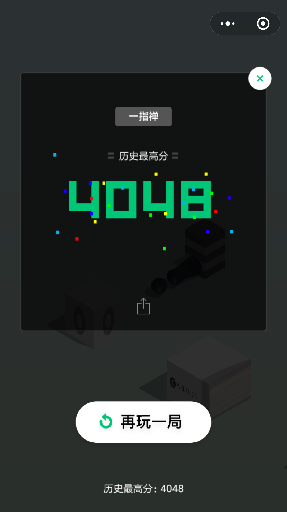

# 教你用 PHP 来玩微信跳一跳



## 原理使用方法
1. 安卓手机开启USB调试后，可以通过adb调试工具截取手机屏幕并将截图下载到电脑上。从而我们可以通过下载下来的图片进行图像分析，从而自动跳跃。
```shell
adb shell screencap -p /sdcard/autojump.png
adb pull /sdcard/autojump.png .
```
  上述命令截取手机屏幕，并将图片保存到电脑。

2. 通过PHP程序读取下载的图像，得到小人的位置和跳跃的目标位置，计算出两点的距离，从而得到需要点击屏幕的时长，从而达到自动跳跃。程序只用到了PHP自带的GD库，使用简单。
```shell
adb shell input swipe x y x y time(ms)
```
  上述命令模拟点击手机屏幕。
  
3. 首先，下载PHP二进制程序，解压至任何路径，并将改路径添加至环境变量，使得在任何路径下都可以运行php.exe

4、打开微信小游戏跳一跳，保存屏幕在跳一跳界面上。

5. 下载本程序，解压至任何路径，执行程序。

```shell
F:\jump>php cmd.php autojump
```
运行程序后，查看手机是否自动跳跃。

6.针对不同手机，程序cmd.php可能需要修改。主要需要修改源码118行处的跳跃系数。

```shell
    $xs = 5.15;
```
该系数是我在小米5SP上测试得到的，其它手机视跳跃的远近适当修改该参数。

## 可能存在的问题。
1、php不能正确执行
```shell
F:\jump>php cmd.php autojump
'php' 不是内部或外部命令，也不是可运行的程序
或批处理文件。
```
出现该提示，请检查是否将php路径添加至环境变量Path中了。

2、手机没有自动跳跃
请在命令程序目录执行命令：
```shell
F:\jump>adb devices
List of devices attached
```
如出现上述提示，说明手机没有连接到电脑，不能进行调试。连接电脑方法和手机开启USB调试功能方法请自行baidu。
正常连接到手机应出现下面提示：
```shell
F:\jump>adb devices
List of devices attached
fca89829        device
```

3、程序在Win10 64,PHP 7.1 NTS测试通过。

  
